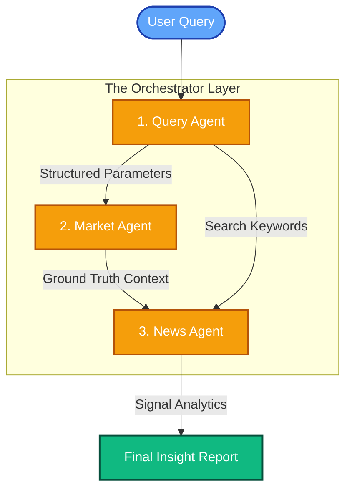

# 🧠 System Algorithms & Core Functions

This document provides a detailed technical deep dive into the architecture, algorithms, and core logic that power the **AI Multi-Agent Market Exploration System**.

---

## 1. Orchestration Algorithm (The Brain)

The system uses a **Sequential Orchestration Pattern** managed by the `MarketInsightOrchestrator` (Python). Every user query is transformed into a structured multi-step reasoning pipeline where each agent’s output enriches the next agent’s prompt.

### Workflow Pipeline:
1.  **Step 1: Deconstruction** (`QueryUnderstandingAgent`)
    - **Input**: Raw natural language query.
    - **Algorithm**: **Few-Shot Extraction**. Uses LLM to map unstructured strings into a rigid JSON schema containing `topic`, `region`, `intent`, and `searchHints`.
2.  **Step 2: Contextualization** (`MarketResearchAgent`)
    - **Input**: Query metadata.
    - **Algorithm**: **Hierarchical Knowledge Lookup**. Uses the `MarketDataTool` to filter internal curated datasets. It builds a "Market Context" (e.g., industry players, regional economic visions like Saudi Vision 2030).
3.  **Step 3: Intelligence Synthesis** (`NewsSignalAgent`)
    - **Input**: Query Summary + Market Context.
    - **Algorithm**: **Contextual Cross-Reference**. Aggregates data from **Finlight API**, **Deep Scraper**, and **Rich Mocks**. The agent evaluates every headline against the Market Context to determine strategic impact.
4.  **Step 4: Packaged Delivery**
    - The orchestrator merges agent outputs, deduplicates evidence, and appends a **Semantic Execution Trace**.

---

## 2. Core Agent Implementation (Python)

### A. Query Understanding Agent (`AI-agents/agents/query_agent.py`)
- **Strategy**: **Intent Classification & Entity Extraction**.
- **Algorithm**: Precise few-shot prompting ensures the LLM never answers the user query directly, but instead extracts the "parameters" needed for the research phase.
- **Output**: `QuerySummary` Pydantic model.

### B. Market Research Agent (`AI-agents/agents/market_agent.py`)
- **Strategy**: **Ground-Truth Establishment**.
- **Algorithm**: **Pattern Matching & Context Injection**.
    - It maps the identified `region` to specific `keyMarkets`.
    - It retrieves qualitative "Overview Points" and "Industry Signals" from the `MarketDataTool`.
- **Logic**: This agent provides the "Baseline Story" that allows the next agent to detect disruptions.

### C. News Signal Agent (`AI-agents/agents/news_agent.py`)
- **Strategy**: **Signal Synthesis & Impact Scoring**.
- **Algorithm**: **Verification Reasoning**.
    - For each signal, the agent must check: *"Does this headline confirm or contradict the Market Context?"*
    - **Strict Formatting**: Enforces JSON structure for `recentDevelopments` and `regionalSignals`.
- **Core Logic**: It uses a specialized system prompt that forbids generic phrases, forcing the LLM to use specific data points from the retrieved records.

---

## 3. Data Flow Diagram

---

## 4. Technical Innovation Algorithms

### 🕵️‍♂️ Semantic Trace Logic
The `MarketInsightOrchestrator` maintains an `executionTrace` string array. Every significant agent decision (e.g., *"query_breakdown: topic=automotive..."*) is pushed to this stack.
*   **Purpose**: Debugging and User Trust.
*   **UI Implementation**: The frontend parses these strings to render a "Live Workflow Progress" bar.

### 🛡️ Graceful Waterfall Failover
In `news_agent.py`, the `run()` method iterates through a list of `data_sources`.
1.  **Attempt API**: If `api` is selected and keys exist.
2.  **Attempt Scrape**: If `scrape` is selected.
3.  **Attempt Mock**: Used for tests or as a fallback.
*   **Result**: The system is highly resilient; a network failure or API limit trigger will not crash the UI, but instead "Waterfall" down to the next available intelligence layer.

### ⚖️ Impact Normalization
The News Agent maps diverse qualitative sentiment into a strict enum: `positive`, `negative`, `mixed`, `neutral`. This algorithm ensures the frontend can consistently render CSS color-coded chips (Green/Red/Orange) regardless of the source LLM's verbosity.
