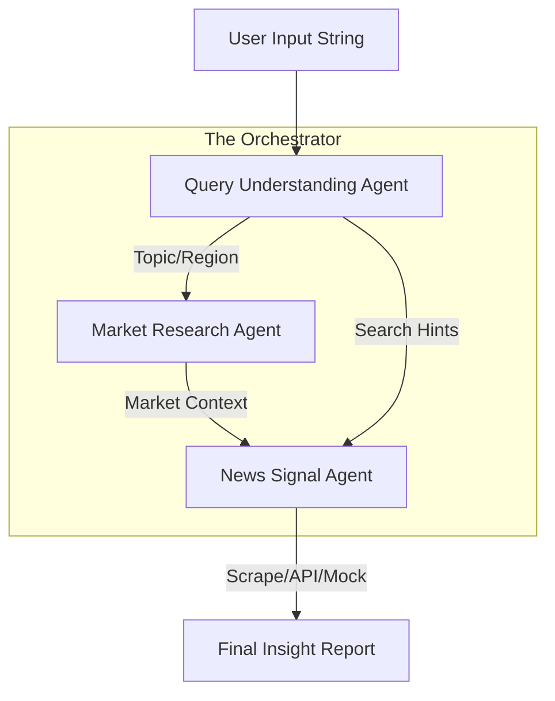

# System Algorithms & Core Functions

This document provides a detailed technical deep dive into the architecture, algorithms, and core logic that power the **AI Multi-Agent Market Exploration System**.

---

## 1. Orchestration Algorithm (The Brain)

The system uses a **Sequential Orchestration Pattern** managed by the `MarketInsightOrchestrator`. Unlike a simple chatbot, this system breaks down a query into a multi-step pipeline where each step's output becomes the "short-term memory" (context) for the next step.

### Workflow Pipeline:
1.  **Step 1: Deconstruction** (`QueryUnderstandingAgent`)
    - **Input**: Raw user string.
    - **Logic**: Uses LLM to extract JSON-structured metadata (Topic, Region, Intent).
2.  **Step 2: Contextualization** (`MarketResearchAgent`)
    - **Input**: Query metadata.
    - **Logic**: Filters internal databases (or external APIs) to find "Ground Truth" about the specific markets identified in Step 1.
3.  **Step 3: Synthesis** (`NewsSignalAgent`)
    - **Input**: Query metadata + Market Ground Truth.
    - **Logic**: Aggregates live news from multiple sources (GNews API, Web Scraping, Mocks). It then "synthesizes" these signals against the market context to determine if they are positive, negative, or mixed.
4.  **Step 4: Aggregation & Tracing**
    - The orchestrator merges all data and adds a **Semantic Execution Trace** for transparency.

---

## 2. Core Agent Functions

### A. Query Understanding Agent (`AI-agents/agents/query-understanding.ts`)
- **`run(query: string)`**: The main entry point.
- **Algorithm**: **Few-Shot JSON Prompting**. It sends the user query to the LLM with strict formatting instructions and examples.
- **Outcome**: A `QuerySummary` object containing the identified topic, region, and "searchHints" used by subsequently data tools.

### B. Market Research Agent (`AI-agents/agents/market-research.ts`)
- **`run(summary: QuerySummary)`**:
- **Algorithm**: **Hierarchical Filtering**.
    - It uses `MarketDataTool` to scan data stores.
    - If the user asked for "Agricultural products" in "Southeast Asia", it filters for `topic === "Agricultural products"` AND (`region === "Southeast Asia"` OR `country` matches the region).
- **Core Tool**: `JsonMarketDataTool` iterates through records to find the most relevant matches.

### C. News Signal Agent (`AI-agents/agents/news-signal.ts`)
- **`run(summary, context, sources)`**:
- **Algorithm**: **Multi-Source Signal Aggregation**.
    - **`fetchLiveNews`**: Calls external APIs (GNews) for the latest headlines.
    - **`scrapeNewsWithCheerio`**: Performs real-time CSS selector extraction from news sites.
    - **`synthesizeSignals`**: This is the "secret sauce." The LLM doesn't just list news; it compares news against the `MarketContext` from Step 2 to provide nuanced impact scores.

---

## 3. Data Flow Diagram

---

## 4. Key Performance Algorithms

### Fuzzy Market Matching
When a user types "SE Asia", the system maps this to "Southeast Asia" using the LLM's semantic capability before the `MarketDataTool` performs its query. This ensures high recall even with informal inputs.

### Semantic Trace Generation
The Orchestrator maintains an `executionTrace` array. Each agent "pushes" its reasoning steps. The system uses Regex on the frontend to parse these strings into a visual timeline, showing exactly how the query was handled.

### Impact Normalization
The `cleanImpact` and `cleanConfidence` functions in `news-signal.ts` ensure that diverse LLM outputs are always mapped to a strict set of values (`positive`, `negative`, `mixed`, etc.) used by the UI's color-coded impact chips.
