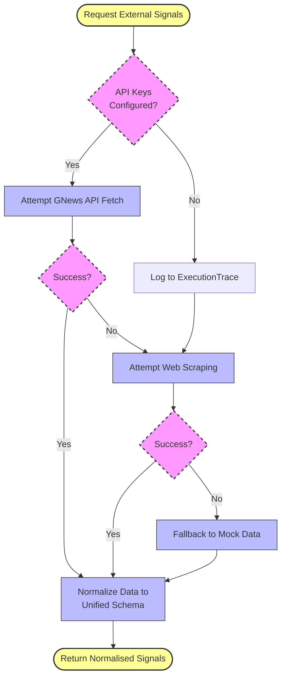

นี่คือไฟล์ `DATA_SOURCES.md` ฉบับภาษาอังกฤษที่สมบูรณ์แบบ พร้อมแผนภาพ Mermaid Diagram ที่จัดวางอย่างมืออาชีพ คุณสามารถก๊อปปี้โค้ดด้านล่างนี้ไปสร้างไฟล์ได้ทันทีครับ

---

# 📊 Data Sources & Intelligence Strategy

This document provides a technical overview of the data architecture, sourcing strategies, and resilience mechanisms implemented in the **AI Multi-Agent Market Exploration System**.

---

## 1. Hybrid Data Architecture

The system is engineered to leverage a mix of structured internal knowledge and dynamic external signals to provide a holistic and contextualized market view.

| Source | Type | Integration Tool | Purpose |
| :--- | :--- | :--- | :--- |
| **Internal JSON** | Structured / Static | `JsonMarketDataTool` | Provides "Ground Truth" market baselines and core industry facts. |
| **GNews API** | Live / Dynamic | `fetchLiveNews` | Aggregates real-time global news headlines and summaries. |
| **Web Scraping** | Live / Unstructured | `scrapeNewsWithCheerio` | Extracts trending headlines from Google News for maximum data freshness. |
| **Mock Signals** | Structured / Testing | `JsonSignalDataTool` | Enables deterministic testing and consistent system demonstrations. |

### Data Flow Overview
The following diagram illustrates how data from multiple sources flows through the specialized agents to produce the final insight report:

```mermaid
graph TD
    %% Define Data Sources
    subgraph DataSources[Data Sources Layer]
        JSON[Internal JSON<br/>(Structured Context)]
        GNews[GNews API<br/>(Dynamic Headlines)]
        Scrape[Web Scraping<br/>(Fresh Headlines)]
        Mock[Mock Signals<br/>(Deterministic Testing)]
    end

    %% Define Agent Layer
    subgraph Agents[AI Agents Layer]
        QUA[Query Understanding Agent]
        MRA[Market Research Agent]
        NSA[News Signal Agent]
    end

    %% Define UI
    User([User Query])
    UI[Final Insight Report]

    %% Data Flow
    User -->|Raw Text| QUA
    QUA -->|Search Hints| NSA
    QUA -->|Metadata| MRA

    %% Tools and Fetching
    MRA -->|Fetches| JSON
    MRA -->|Context| NSA

    NSA -.->|API Call| GNews
    NSA -.->|Scrapes| Scrape
    NSA -.->|Reads| Mock

    NSA -->|Synthesized Insights| UI
    MRA -->|Market Ground Truth| UI

    %% Styling
    classDef source fill:#f9f,stroke:#333,stroke-width:2px;
    classDef agent fill:#bbf,stroke:#333,stroke-width:1px;
    class JSON,GNews,Scrape,Mock source;
    class QUA,MRA,NSA agent;
```

---

## 2. Engineering Insights & Implementation

### 🧠 Mock Data & System Determinism
During the prototype stage, we utilize structured JSON files (`mock-market-data.json`) to establish a controlled testing environment:
- **Baseline Verification**: Ensures the agent's reasoning logic is verified against a known set of facts before introducing live variables.
- **Search Optimization**: Records are indexed by `topic`, `region`, and `country`, enriched with `searchHints` to facilitate rapid keyword matching.

### 🔄 Dynamic Query Transformation
To maximize the relevance of external data, the system performs **Query Narrowing** via the `QueryUnderstandingAgent`:
- User queries are transformed into optimized search strings (e.g., appending "market outlook" or "supply chain disruption") to ensure high-quality retrieval from live sources.

### 🛠 Unstructured Data Synthesis
Web scraping via Cheerio bypasses API indexing delays, capturing the most recent events:
- **Synthesis Logic**: Raw headlines are fed into the `NewsSignalAgent`'s synthesis layer, where the LLM extracts key entities and sentiments, converting them into a structured schema.

### 🏗 Data Normalization Layer
Across all sources, a **Normalization Mapping** process is implemented:
- All inputs are transformed into a unified `ExternalSignalRecord` interface. This decoupling ensures that downstream analysis agents remain agnostic of the data's origin.

---

## 3. Resilience & Fallback (Graceful Degradation)

To maintain functionality under API constraints or network failures, a **Multi-Layered Failover (Waterfall)** mechanism is implemented:



---

## ⚙️ Configuration

To enable live data fetching, ensure the following environment variables are set:

- **GNews API**: Set `GNEWS_API_KEY` in the `.env` file.
- **Groq Cloud**: Ensure `GROQ_API_KEY` is configured for agent synthesis.
- **Auto-Fallback**: If keys are missing, the system will log the status in the `executionTrace` and automatically default to Mock Mode.

---
*Note: This data strategy is designed to showcase "AI Application Thinking" and "Engineering Rigor" as per the assignment evaluation criteria.*
