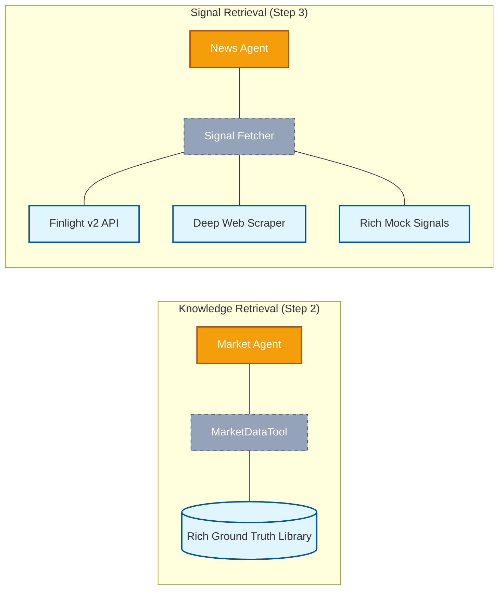
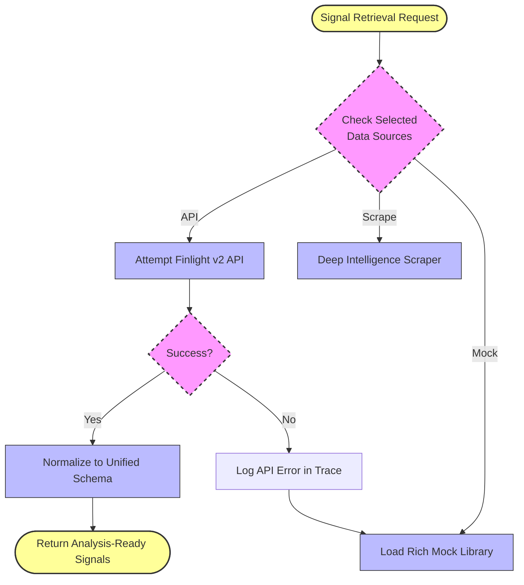

# 📊 Data Sources & Intelligence Strategy

This document provides a technical overview of the data architecture, sourcing strategies, and resilience mechanisms implemented in the **AI Multi-Agent Market Exploration System**.

---

## 1. Hybrid Data Architecture

The system is engineered to leverage a mix of structured internal knowledge and dynamic external signals to provide a holistic and contextualized market view.

| Source | Type | Integration Tool | Purpose |
| :--- | :--- | :--- | :--- |
| **Rich Internal Data** | Structured Library | `MarketDataTool` | Provides "Ground Truth" market baselines, industry players, and regional visions. |
| **Finlight v2 API** | Live / Dynamic | `FinlightNewsTool` | Primary source for high-quality financial news and global market headlines. |
| **Deep Web Scraper** | Live / Technical | `WebScrapingTool` | Deep-dives into technical data points (e.g., specific factory-gate price trends or logistics delays). |
| **Rich Mocks** | Structured / Testing | `SignalDataTool` | Provides high-fidelity curated data for demo and testing purposes. |

### Data Flow Overview

---

## 2. Intelligence Strategies & Implementation

### 🏥 Rich Mock Data Library
Instead of simple generic strings, the system uses a **Curated Market Library** (`RICH_MOCK_DATA`) keyed by `(region, topic_category)`.
*   **Categories**: Automotive, EV, Electronics, Agriculture, Textiles, Pharma, Energy, etc.
*   **Depth**: Includes specific figures (e.g., *"USD 4.2B market size"*), competitor names (*"Al-Jomaih AutoWorld"*), and regional policy links (*"Vision 2030"*).
*   **Result**: Allows the LLM to perform high-fidelity reasoning even in "Mock Mode".

### 🌊 Finlight v2 News Integration
The **Finlight News API** provides real-time financial articles.
*   **Keyword Optimization**: The system uses `searchHints` (extracted from the user's intent) to query the API for maximum relevance.
*   **Localization**: When a region is detected, the system maps it to specific **ISO Country Codes** to filter news by geography.

### 🕵️‍♂️ Deep Web Scraper (Deep Intelligence)
The `WebScrapingTool` simulates an "Active Intelligent Agent" that goes beyond general news.
*   **Targeting**: Focusing on technical insights like *"Logistics Cost Reductions"* or *"Tier-3 Supplier Pricing Dynamics"*.
*   **Output**: Returns `[DEEP RESEARCH]` records that provide a higher level of analytical detail than standard news headlines.

---

## 3. Resilience & Fallback (Graceful Degradation)

To maintain functionality under API constraints or connectivity issues, a **Waterfall Failover Logic** is implemented in the `NewsSignalAgent`:

---

## ⚙️ Configuration

To enable the full intelligence stack, ensure these environment variables are configured:

- **GROQ_API_KEY**: Required for Agent LLM reasoning.
- **FINLIGHT_API_KEY**: Required for live financial news retrieval.

---
*Note: This data strategy focuses on "Actionable Industrial Intelligence" rather than generic information retrieval.*
