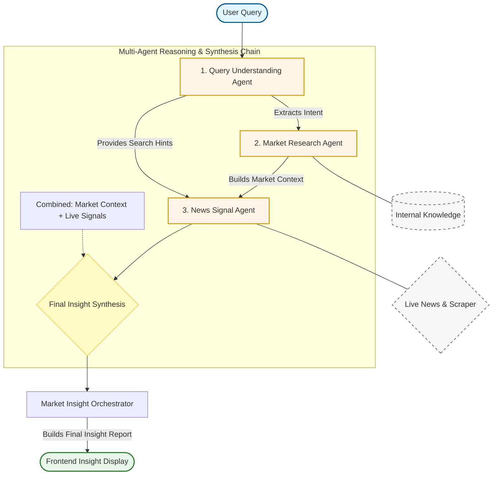

# 🚀 AI Multi-Agent Market Exploration System

Welcome to the **Market Intelligence Assistant**, a high-performance prototype designed for global trading firms. This system bridges the gap between static market knowledge and real-time global events, helping international trade teams make informed decisions in volatile markets (e.g., Agricultural Goods, Automotive Parts, and Convenience Food).

---

## 🎯 Strategic Purpose & Business Value

General search engines return noise. Standard AI chatbots lack current context. This system uses **Collaborative AI Agents** to deliver precise, actionable insights. 

**Key Business Use Cases:**
1. **Market Disruption Analysis:** *“How do recent floods in Southeast Asia affect regional agricultural exports?”* The AI establishes historical baseline stability and synthesizes it with real-time weather/policy news to assess immediate risk.
2. **Rapid Signal Filtering:** *“Are there any supply chain issues for car spare parts in Germany?”* The AI acts as a specialized filter, ignoring general news and extracting only headlines with direct industrial or economic impact.
3. **Cross-Regional Opportunity Mapping:** Easily compare market sentiments across different global regions with normalized, easy-to-read impact scorecards.

---
A high-performance prototype designed to demonstrate **Collaborative AI Intelligence**. This system breaks down complex market research tasks into a multi-agent pipeline, synthesizing internal ground-truth data with real-time external signals.

---

## 🏗 System Architecture

The system follows a **Stateless Sequential Orchestration** pattern. It transforms a single user query into a structured multi-step reasoning process.



---

## 🧠 AI Agent Design & Technical Analysis

Instead of a single "monolithic" LLM call, this system utilizes **Specialized Agents** to ensure high precision and reduce hallucination.

### 1. Query Understanding Agent (The Linguist)
* **Role**: Converts unstructured natural language into a structured **Search Schema**.
* **Technical Logic**: Uses **Few-Shot Prompting** to extract `topic`, `region`, and `intent`. It generates `searchHints`—a set of optimized keywords used by downstream data tools to ensure high recall.
* **Design Decision**: By isolating intent extraction, we prevent "Prompt Bleed" where the AI might try to answer the question before gathering facts.

### 2. Market Research Agent (The Historian)
* **Role**: Establishes the **Ground Truth** using internal data stores.
* **Technical Logic**: Performs **Hierarchical Filtering** on internal JSON records. It constructs a "Market Context" which acts as the foundational knowledge (e.g., key players, regional strengths).
* **Context Injection**: The output of this agent is injected into the next agent’s prompt, providing a "baseline" to compare new information against.

### 3. News Signal Agent (The Analyst)
* **Role**: Aggregates live/mock data and performs **Contextual Synthesis**.
* **Technical Logic**: This agent performs a **Cross-Reference Analysis**. It evaluates headlines from GNews or Web Scraping against the "Market Context" from Agent 2. 
* **Outcome**: It doesn't just list news; it assigns **Impact scores** (Positive/Negative) and **Confidence levels**, identifying if recent events reinforce or disrupt existing market trends.

---

## 🛠 Engineering Excellence

### 🌊 Waterfall Data Fallback (Resilience)
The system is built with **Graceful Degradation**. In the `NewsSignalAgent`, the workflow follows a prioritized data fetching logic:
1.  **Live API**: Fetches real-time headlines (Primary).
2.  **Web Scraping**: Falls back to scraping if API keys are missing or limits are reached.
3.  **Mock Data**: Ensures the UI always displays valid insights even in offline/demo modes.

### 🕵️‍♂️ Semantic Execution Trace (Transparency)
To solve the "AI Black Box" problem, the `MarketInsightOrchestrator` maintains a real-time **Execution Trace**. Every decision, from parsed intent to the number of news signals found, is logged and displayed in the UI, allowing for full auditability of the AI's reasoning path.

### 🧹 Data Normalization & Type Safety
* **Normalization**: Data from diverse sources (API, Scraper, JSON) is mapped into a unified `ExternalSignalRecord` interface before reaching the LLM.
* **TypeScript**: Strict typing across the `Orchestrator` and `Agent` interfaces ensures that data contracts between agents are never broken.

---

## 🚀 Getting Started

### Prerequisites
- Node.js 18+
- Groq Cloud API Key (for LLM Inference)
- GNews API Key (Optional, for Live News)

### Installation
```bash
# Install dependencies for all workspaces
npm install

# Set up environment variables
cp .env.example .env
# Edit .env and add your GROQ_API_KEY
```

### Running the App
```bash
# Run the Next.js development server
npm run dev
```
Open [http://localhost:3000](http://localhost:3000) to explore the system.

---

## 📊 Evaluation Criteria Match
- **System Architecture (25%)**: Demonstrated via Sequential Orchestration and Mermaid diagrams.
- **AI Agent Design (25%)**: Multi-agent collaboration with context passing and specialized roles.
- **Backend Engineering (20%)**: Hybrid data sourcing (API, Scraping, JSON) and normalization.
- **Frontend Usability (15%)**: Real-time workflow visualization and clean insight chips.
- **Documentation (15%)**: Comprehensive README and DATA_SOURCES.md files.

---
*Developed as part of the Full-Stack AI Engineer Technical Assignment.*

