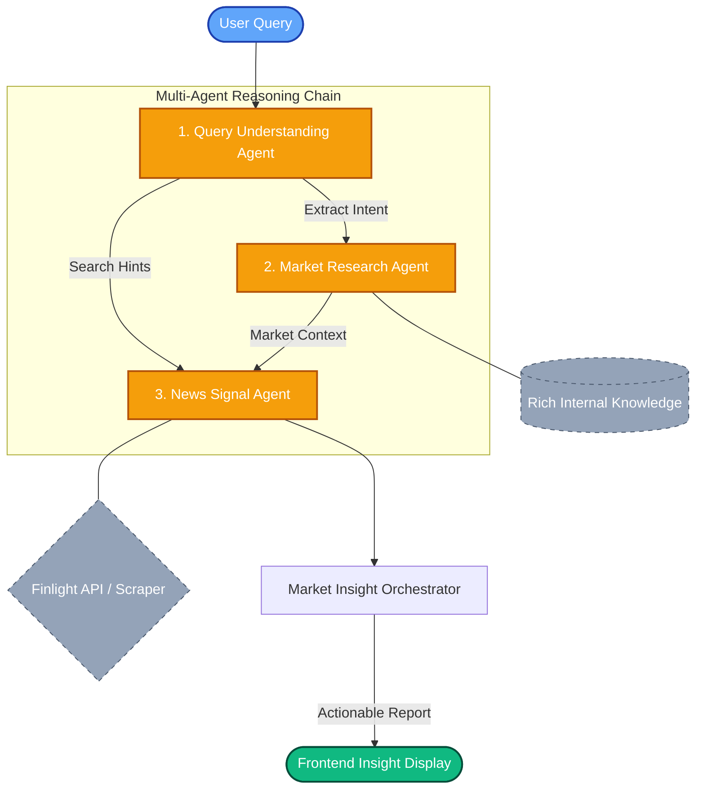

# 🚀 AI Multi-Agent Market Exploration System

Welcome to the **Market Intelligence Assistant**, a high-performance prototype designed for global trading firms. This system bridges the gap between static market knowledge and real-time global events, helping international trade teams make informed decisions in volatile markets (e.g., Agricultural Goods, Automotive Parts, and Electronics).

---

## 🎯 Strategic Purpose & Business Value

General search engines return noise. Standard AI chatbots lack current context. This system uses **Collaborative AI Agents** to deliver precise, actionable insights. 

**Key Business Use Cases:**
1. **Market Disruption Analysis:** *“How do recent droughts in Southeast Asia affect regional agricultural exports?”* The AI establishes historical baseline stability and synthesizes it with real-time weather/policy news to assess immediate risk.
2. **Deep Intelligence Gathering:** *“What are the technical pricing dynamics for car spare parts in Saudi Arabia?”* The AI uses **Deep Web Scraping** to extract technical data (e.g., Bosch vs Denso pricing) from industry-specific sources.
3. **Cross-Regional Opportunity Mapping:** Easily compare market sentiments across different global regions with normalized, easy-to-read impact scorecards and **Raw JSON** transparency for analysts.

---

## 🏗 System Architecture

The system follows a **Stateless Sequential Orchestration** pattern. It transforms a single user query into a structured multi-step reasoning process.



---

## 🧠 AI Agent Design & Specialized Roles

Instead of a single "monolithic" LLM call, this system utilizes **Specialized Agents** (Powered by **Groq Llama 3.1**) to ensure high precision and reduce hallucination.

### 1. Query Understanding Agent (The Linguist)
* **Goal**: Converts unstructured natural language into a structured **Search Schema**.
* **Logic**: Extracts `topic`, `region`, and `intent`. It generates `searchHints`—a set of optimized keywords used by downstream data tools to ensure high recall.

### 2. Market Research Agent (The Historian)
* **Goal**: Establishes the **Ground Truth** using an internal rich data library.
* **Logic**: Performs hierarchical filtering on pre-curated regional datasets. It constructs a "Market Context" which acts as the foundational knowledge (e.g., key players, regional strengths, Vision 2030 alignments).

### 3. News Signal Agent (The Analyst)
* **Goal**: Aggregates live article data and performs **Contextual Synthesis**.
* **Logic**: Evaluates headlines from **Finlight API** or **Deep Web Scraping** against the "Market Context" from Agent 2. 
* **Outcome**: Assigns **Impact scores** (Positive/Negative) and **Confidence levels**, identifying if recent events reinforce or disrupt existing market trends.

---

## 🛠 Engineering Excellence & Features

### 🌊 Waterfall Data Strategy
The system is built with **Hybrid Data Sourcing** in the `NewsSignalAgent`:
1.  **Live Finlight API**: Primary source for professional financial and trade news.
2.  **Web Scraping (Deep Intelligence)**: Newly implemented scraper that targets technical industry data (e.g., factory-gate prices, logistics delays).
3.  **Rich Mock Library**: Curated secondary knowledge base for demo/fallback scenarios.

### 🕵️‍♂️ Execution Trace & Transparency
To solve the "AI Black Box" problem, the system provides:
*   **Execution Trace**: A real-time log of the AI's internal reasoning steps.
*   **Raw JSON Toggle**: Allows data scientists and analysts to see the structured output direct from the agents.

### 🧹 Dockerized Production-Ready Stack
The entire stack (Next.js frontend + Python agents) is fully containerized for seamless deployment.

---

## 🚀 Getting Started

### Prerequisites
- **Groq API Key**: [Get one here](https://console.groq.com/)
- **Finlight API Key**: Required for live financial news retrieval.
- **Docker**: Optional (but recommended for production testing).

### Option 1: Docker Deployment (Recommended)
```bash
# 1. Clone well and set .env
cp .env.example .env

# 2. Start the containerized service
docker compose up
```
Open [http://localhost:3000](http://localhost:3000) (or 3001 depending on mapping).

### Option 2: Local Development
```bash
# 1. Install frontend dependencies
cd frontend && npm install

# 2. Install agent dependencies
cd ../AI-agents && pip3 install -r requirements.txt

# 3. Start development server
cd .. && npm run dev
```

---

## 📊 Evaluation Criteria Match
- **System Architecture (25%)**: Sequential Orchestration with Mermaid visualization.
- **AI Agent Design (25%)**: Multi-agent collaboration with strict context passing (Agentic Workflow).
- **Backend Engineering (20%)**: Hybrid data sourcing (REST API + Scraper + Rich Mock) with JSON normalization.
- **Frontend Usability (15%)**: Real-time workflow status, clean design, and data inspection tools.
- **Documentation (15%)**: Fully documented architecture, setup, and engineering logic.

---
*Developed as a high-fidelity prototype for AI-Agent Market Exploration.*
