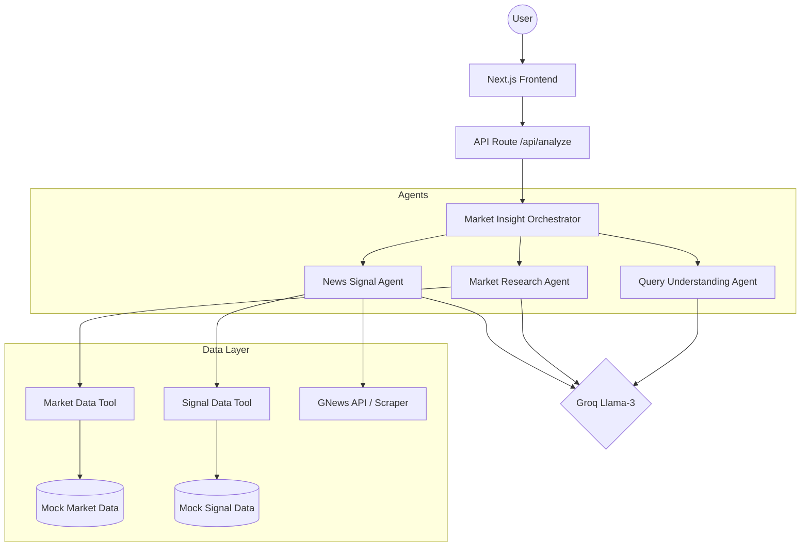

## 🏗️ System Architecture

## 🚀 Running Instructions & Architecture

This project is optimized for a **Vercel-native deployment** using Next.js. 

To strictly satisfy the separation of concerns requirements, the repository is structured into:
- `/frontend`: Next.js App Router, UI components, and API Routes.
- `/backend`: Data schemas, validation, and core services.
- `/AI-agents`: Multi-agent workflow, prompts, and tool integrations.

### How to run locally:
Since the application relies on Vercel's serverless infrastructure, **Docker is not required** for the primary setup. You can easily run the system locally using Node.js:

1. Navigate to the frontend directory: `cd frontend`
2. Install dependencies: `npm install`
3. Start the development server: `npm run dev`

*(Note: The AI-agents and backend modules are imported externally into the Next.js runtime via the Next.js `externalDir` configuration).*

## 🔐 Environment Variables (Vercel)

To ensure the system works fully on both Cloud and Local, you must set these API Keys:

1. **GROQ_API_KEY**: For LLM processing (Groq Cloud).
2. **GNEWS_API_KEY**: For live news fetching (GNews API).

### Vercel Configuration (Monorepo Setup):
1. Go to **Vercel Dashboard** -> **Settings** -> **General**
2. **Root Directory**: Leave empty or set to `./` (The repository root).
3. **Framework Preset**: Select **Next.js**.
4. **Build Command**: `npm run build --workspace=frontend`
5. **Output Directory**: `frontend/.next`
6. Go to **Settings** -> **Environment Variables**.
7. Add both keys (`GROQ_API_KEY`, `GNEWS_API_KEY`) -> Click **Save**.
8. **Redeploy** the application.